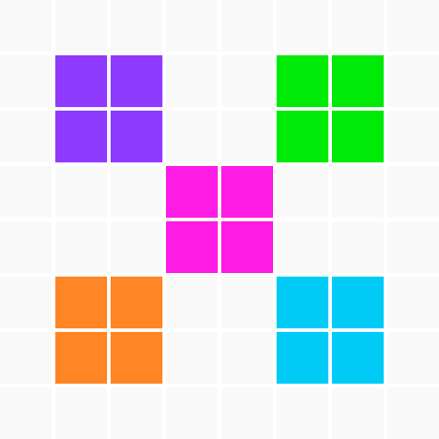

==================================================
Concepts de programmation avec Python et l'Oxocard
==================================================

..  admonition:: Information importante
    :class: tip

    Ce tutoriel est une traduction libre du tutoriel *TigerJython4Kids /
    Oxocard* rédigé en allemand par le Dr. Aegidius Plüss
    (https://www.tigerjython4kids.ch/index.php?inhalt_links=robotik/navigation.inc.php&inhalt_mitte=robotik/oxocard/funktionen.inc.php).

Sommaire
::::::::

.. toctree::
    :numbered:
    :maxdepth: 2

    presentation-oxocard/index
    mise-en-route/index
    premiers-programmes/index
    repetitions/index

Liens utiles
::::::::::::

*   Site de l'Oxocard : https://oxocard.ch/fr/
*   Acheter une Oxocard : https://shop.oxon.ch/?shop=oxocard&lang=fr
