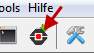
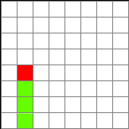
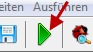
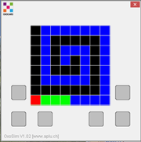
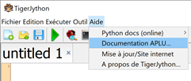

Premier programme
=================

Pour commencer, écrivons un programme qui montre une simple figure de
serpent sur l'écran que nous appellerons ``LedGrid``. Lancez TigerJython
et tapez le programme ci-dessous dans la fenêtre de l'éditeur.

::

    from oxosnake import *

    makeSnake()

Vérifiez si l'Oxocard est connectée à l'ordinateur et cliquez sur le
bouton Télécharger/Exécuter.

Si la figure ci-contre apparaît sur l'écran de votre Oxocard, c'est
qu'elle fonctionne correctement.

Explication du code
~~~~~~~~~~~~~~~~~~~

-  La première ligne de programme importe le module ``snake``.
-  À la deuxième ligne, un objet serpent est créé et affiché. Dans le
   chapitre suivant, vous apprendrez comment déplacer le serpent.

Exécution des quatre derniers programmes téléchargés
~~~~~~~~~~~~~~~~~~~~~~~~~~~~~~~~~~~~~~~~~~~~~~~~~~~~

-  Les quatre derniers programmes téléchargés restent stockés sur
   l'Oxocard. Si vous réinitialisez l'Oxocard ou connectez une
   alimentation électrique via le câble USB, le dernier programme
   téléchargé démarre.
-  A côté de la fenêtre TigerJython, une deuxième fenêtre apparaît
   pendant l'exécution du programme, la **fenêtre de Terminal** (parfois
   appelée aussi REPL/Console). Les messages et les messages d'erreur y
   sont affichés et vous pouvez également annuler à tout moment
   l'exécution d'un programme avec la combinaison de touches Ctrl+C. Si
   vous voulez redémarrer le programme, appuyez sur les deux touches
   reset (ou Ctrl+D).

Mode simulé
===========

Pour exécuter un programme en mode simulation, cliquez sur le bouton
vert "Play".

Actuellement en mode simulation, toutes les commandes des modules
``oxosnake``, ``oxocard``, ``oxobutton`` et ``oxoaccelerometer`` sont
supportées. Cela fait apparaître une fenêtre de simulation que vous
pouvez déplacer en maintenant le bouton de la souris enfoncé. Au
démarrage du programme suivant, la fenêtre précédente se ferme
automatiquement.

Documentation de l'API Oxocard
==============================

Vous trouverez une description des modules développés spécialement pour
Oxocard dans le menu Aide de TigerJython, sous Documentation APLU

