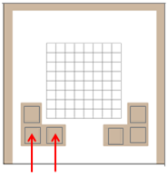
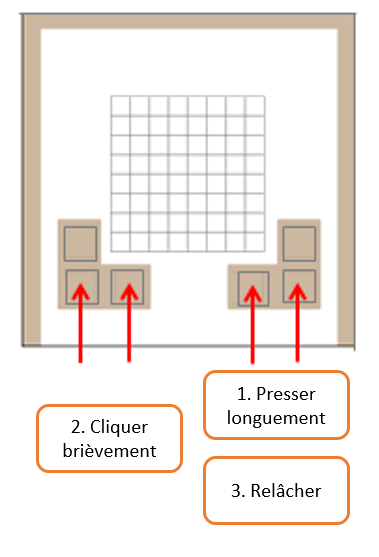
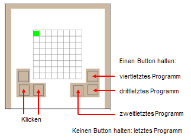

Commandes pour gérer l'Oxocard
==============================

Redémarrer (reset) et démarrer l'Oxocard
----------------------------------------

Le redémarrage de l'Oxocard s'effectue par une combinaison de touches
spéciale. Pour ce faire, appuyez brièvement sur les deux touches de
gauche en même temps.

Éteindre l'Oxocard
------------------

L'Oxocard n'a pas d'interrupteur marche/arrêt, mais est arrêté par une
combinaison spéciale de touches. Pour ce faire, maintenez enfoncés les
deux boutons dans le coin inférieur droit et cliquez brièvement sur les
boutons de réinitialisation. Maintenez les deux touches de droite
enfoncées jusqu'à ce qu'une croix rouge s'allume et disparaisse
lentement. L'Oxocard est maintenant en "mode veille" et sa consommation
d'énergie est très faible.

Petit exercice
++++++++++++++

..  mchoice:: mc-oxocard-functions-shutdown

    Essayez d'éteindre votre Oxocard en appuyant sur les boutons comme indiqué
    ci-dessus dans le bon ordre. Cochez ensuite ce qui convient

    ..

    -   J'ai réussi à éteindre mon Oxocard

        +   Super! Ce n'est pas une manipulation facile. Il serait bon de mettre
            un lien vers cette page dans vos favoris car il n'est pas facile de se
            souvenir de cette manipulation. Soyez aussi prêt à montrer à ceux
            qui n'y arrivent pas comment faire.

    -   Je n'y arrive pas

        -   Il ne faut pas abandonner. L'enseignant va voir dans son tableau de
            contrôle que vous n'avez pas réussi à exécuter le code. Il faut
            réessayer à plusieurs reprises jusqu'à ce qu'une grosse croix rouge
            apparaisse sur l'écran LED. À force d'essai, vous allez y arriver.

            Après plusieurs tentatives infructueuses, demandez aux personnes qui
            ont réussi à éteindre leur Oxocard.

Exécuter l'un des quatre derniers programmes téléchargés
--------------------------------------------------------

Après le téléchargement et une réinitialisation, le dernier programme
téléchargé est toujours lancé automatiquement. Mais si vous maintenez
l'un des boutons de droite enfoncé, l'avant-dernier, l'antépénultième ou
l'avant-avant-avant-dernier programme téléchargé sera lancé. Le
démarrage du programme est indiqué par un bref clignotement de la LED
verte dans le coin supérieur gauche.

