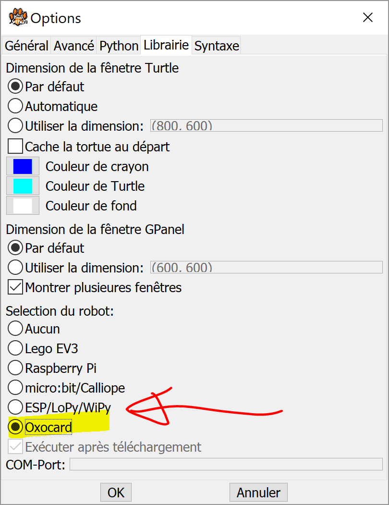
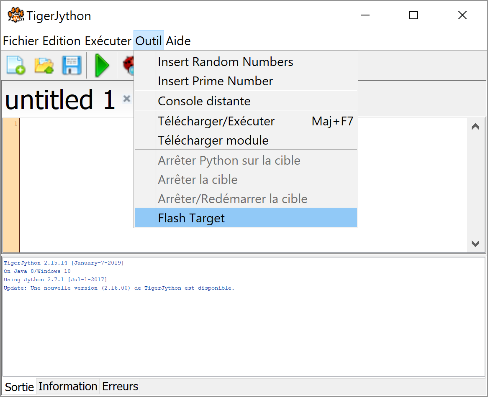
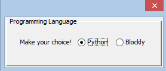

.. _programming-oxocard-in-python:

Programmer l'Oxocard en Python
==============================

Environnement de développement TigerJython
------------------------------------------

Les programmes sont développés avec
`TigerJython <https://www.tjgroup.ch/engl/index.php>`_ sur un
ordinateur (PC ou Mac), puis téléchargés sur l'Oxocard et exécutés par
`MicroPython <https://micropython.org/>`_ (une version réduite de
Python pour microcontrôleurs). Le programme est téléchargé via un câble
USB qui alimente également l'Oxocard. Les instructions pour télécharger
et installer TigerJython se trouvent en cliquant sur le bouton de
droite. **Il est vivement conseillé de toujours utiliser la dernière
version de TigerJython.**

`Lernumgebung
<http://www.tigerjython.fr/franz/index.php?inhalt_links=navigation.inc.php&inhalt_mitte=lernumgebung/einrichtung.inc.php>`__

..  poll:: poll-tj-installation-personal-pc
    :scale: 2
    :allowcomment:

    Avez-vous réussi à installer et exécuter avec succès TigerJython sur votre
    **ordinateur personnel**?

..  poll:: poll-tj-installation-school
    :scale: 2
    :allowcomment:

    Avez-vous réussi à installer et exécuter avec succès TigerJython sur votre
    **poste de travail à l'école**?

Connexion USB
-------------

Connectez l'Oxocard à votre ordinateur (Mac ou Windows) à l'aide d'un
câble USB.

-  Windows 10 détecte automatiquement le périphérique USB. Aucune
   installation de pilote n'est nécessaire.
-  Sur Windows 7, 8 et Mac, il faut installer un pilote USB. Téléchargez
   le fichier du pilote pour MacOS ou Windows, décompressez-le et
   exécutez-le en un seul clic. Vous aurez besoin des droits
   d'administrateur pour le faire.

   Pilote pour le Mac :

   ` <http://www.tigerjython4kids.ch/download/CH341SER_MAC.zip>`__

   Pilote pour le PC :

   ` <http://www.tigerjython4kids.ch/download/CH341SER_WIN7_WIN8.zip>`__

Vérifiez si la carte est reconnue correctement

-  sous Windows : dans le Gestionnaire de périphériques sous
   Ports(COM&LPT)
-  sous MacOS : dans le terminal avec la commande la commande

   ::

       ls /dev/tty.*

..  poll:: poll-oxocard-usb-connexion
    :scale: 2
    :allowcomment:

    Avez-vous réussi à installer et exécuter avec succès TigerJython sur votre
    **poste de travail à l'école**?

Installation du firmware sur l'Oxocard
--------------------------------------

Avant d'utiliser l'Oxocard pour la première fois, vous devez télécharger
un firmware qui contient l'interpréteur MicroPython et quelques modules
écrits spécialement pour l'Oxocard.

**Avec TigerJython**
~~~~~~~~~~~~~~~~~~~~

Sous Paramètres/Bibliothèques, sélectionnez l'option Oxocard. Vous
pouvez laisser le champ de saisie COM-Port vide, car le Port COM est
normalement détecté automatiquement. Ce réglage reste mémorisé et est
également nécessaire pour télécharger les programmes. Sélectionnez
**Flash Target** dans le menu *Outils*.

Commencer par choisir l'Oxocard comme périphérique connecté à
TigerJython

Installer le firmware spécial MicroPython sur l'Oxocard pour pouvoir
exécuter les programmes Python.

Sélectionnez l'option "Python" dans la boîte de dialogue et le firmware
Python sera installé et les modules de bibliothèque développés par nos
soins seront téléchargés sur l'Oxocard.

-  **Informations techniques (mise à jour des modules)**

   Les modules Oxocard (``oxocardmodules`` sont situés dans le
   répertoire que vous avez choisi pour l'installation de TigerJython
   dans le sous-dossier ``bin/Lib/oxocardmudules``.

   Vous n'avez pas besoin de refaire toute l'installation lors de la
   mise à jour. Dans l'éditeur TigerJython, il suffit d'ouvrir le module
   correspondant (par exemple `snake.py <http://snake.py/>`__) et de
   sélectionner ***Outils / Télécharger module***.

   .. figure:: Untitled-b2b593f8-5199-4bd2-b22e-677ce4a2c16e.png
      :alt: 

   Téléchargement d'un module sur l'Oxocard sans refaire une
   installation complète du firmware

TigerJython demande, lors du flash, s'il faut restaurer la version
d'usine du firmware pour pouvoir réutiliser l'Oxocard avec l'éditeur en
ligne Blockly de la firme OXON.

**Avec OxoFlash**
~~~~~~~~~~~~~~~~~

Avec un ordinateur Windows ou Mac, on peut toujours flasher l'Oxocard
sans TigerJython. Il suffit de télécharger l'application OxoFlash et de
la lancer :

-  Windows

` <http://www.tigerjython4kids.ch/download/OxoFlash.msi>`__

-  MacOS

` <http://www.tigerjython4kids.ch/download/OxoFlash.dmg>`__

(Pour MacOS, vous devez d'abord exécuter le programme ``unlock`` avec un
clic droit de la souris dans le terminal.)

Le programme suppose qu'une connexion USB à l'Oxocard a été établie
comme décrit dans la section précédente. Une boîte de sélection permet
de choisir de flasher le firmware MicroPython ou Blockly original.

Recharger l'Oxocard
-------------------

L'Oxocard est chargé à chaque fois qu'elle est connectée par un câble
USB à une source de tension USB 5V telle qu'un ordinateur, un chargeur
USB standard ou un bloc d'alimentation USB.

