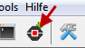

Votre premier programme avec le serpent
=======================================

Étudiez le programme ci-dessous (essayez de deviner ce qu'il va faire)
et copiez-le dans TigerJython puis exécutez-le sur l'Oxocard ou dans le
simulateur.

Programme à étudier
~~~~~~~~~~~~~~~~~~~

Étudiez le code ci-dessous puis répondez aux questions
:ref:`first-snake-program-questions` AVANT d'exécuter le code !!! Pour
télécharger et exécuter le programme sur l'Oxocard, cliquez sur le bouton noir
(Télécharger/Exécuter) dans la barre des tâches.

..  activecode:: ac-first-snake-program-example-1
    :language: python
    :caption: Code Python à copier/coller dans TigerJython et à exécuter sur l'Oxocard ou en mode simulé
    :enabledownload:
    :nocodelens:

    from oxosnake import * 

    makeSnake()

    forward()
    forward()
    right(90)
    forward(2)

.. _first-snake-program-questions:

Questions à propos du code
~~~~~~~~~~~~~~~~~~~~~~~~~~

.. tabbed:: tab-first-snake-program-question-1

   .. tab:: Question 1

      Que signifient les mots anglais ``forward`` et ``right`` utilisés
      dans le programme? Essayez de deviner l'effet que ces commandes
      produisent sur le serpent.
      
      .. shortanswer:: short-first-snake-program-question-1

         Répondre courtement ci-dessous   
      
   .. tab:: Réponse

      -  En anglais, "forward" signifie "avancer" et "right" signifie
         "droite = tourner à droite".
      -  Pour le reste, il suffit d'exécuter le code pour voir ce qu'il
         fait ... c'est donc l'ordinateur qui va vous donner la réponse
         définitive.

.. tabbed:: tab-first-snake-program-question-2

   .. tab:: Question 2

      Le bon programmeur est celui qui voit les détails ! Avez-vous vu le
      ``90`` dans ``right(90)`` ? À votre avis, que signifie ce
      **paramètre** ? Exécutez le code en mettant ``45`` puis ``135`` ou
      ``180`` à la place de ``90``. Comment le serpent se comporte-t-il ?

      .. shortanswer:: short-first-snake-program-question-2

         Répondre courtement ci-dessous   

   .. tab:: Réponse

      -  Il s'agit de l'\ **angle de rotation** du serpent qui indique
         **de combien** il doit se tourner vers la droite (right).
      -  Il est possible d'indiquer des angles multiples de 45°. Cela va
         faire que le serpent se déplace en diagonale.

.. tabbed:: tab-first-snake-program-question-3

   .. tab:: Question 3

      Le bon programmeur est celui qui voit les détails ! Avez-vous vu le
      ``90`` dans ``right(90)`` ? À votre avis, que signifie ce
      **paramètre** ? Exécutez le code en mettant ``45`` puis ``135`` ou
      ``180`` à la place de ``90``. Comment le serpent se comporte-t-il ?

      .. shortanswer:: short-first-snake-program-question-3

         Répondre courtement ci-dessous   

   .. tab:: Réponse

      -  Les angles négatifs sont tout-à-fait possibles ! Ils font juste
         tourner le serpent à gauche ...
      -  Les angles "à virgule" tels que ``35.24`` sont possibles et ne
         causent pas de problème. Par contre, on voit que le serpent
         continue de tourner avec un angle de 45°. Cela vient du fait
         que l'angle, avant d'être considéré comme angle de rotation,
         est d'abord arrondi au plus proche multiple de 45°.
      -  Les angles supérieurs à 360° sont possibles. Il faut juste voir
         que de tourner de 0°, 360° ou 720° a exactement le même effet.
         On dit que les angles sont calculés "modulo 360°".

.. tabbed:: tab-first-snake-program-question-4

   .. tab:: Question 4

      Vous constatez que l'on peut modifier le comportement de la commande
      ``right`` en ajoutant un nombre entre parenthèses. Essayez de faire
      de même pour la commande ``forward`` ... Que constatez-vous ? Quelle
      est la signification du paramètre de ``forward`` ?

      .. shortanswer:: short-first-snake-program-question-4

         Répondre courtement ci-dessous   

   .. tab:: Réponse

      -  On peut très bien appeler la commande ``forward`` en
         fournissant un nombre en guise de paramètre. Cela va indiquer
         le nombre de "pas" (cases) dont le serpent va avancer.
      -  **Exemple** : La commande ``forward(3)`` fait avancer le
         serpent de 3 cases au lieu d'une seule.

.. tabbed:: tab-first-snake-program-question-5

   .. tab:: Question 5

      À quoi peut bien servir l'instruction ``import`` au tout début du
      programme? Le programme fonctionne-t-il encore si on supprimer cette
      ligne ?

      .. shortanswer:: short-first-snake-program-question-5

         Répondre courtement ci-dessous   

   .. tab:: Réponse
   
      Le programme ne pourrait pas fonctionner sans cette ligne. Elle
      sert en fait à charger le module ``oxosnake`` qui contient la
      définition des classes et des fonctions nécessaires au programme.
      Ce module contient donc par exemple la définition de

      -  La fonction ``makeSnake()``
      -  Les commandes ``forward()`` et ``right()`` utilisées dans le
         programme

.. tabbed:: tab-first-snake-program-question-6

   .. tab:: Question 6

      Supprimez la première ligne ``import oxosnake`` et exécutez à nouveau
      le programme ! Quel message d'erreur Python affiche-t-il ?

      .. shortanswer:: short-first-snake-program-question-6

         Répondre courtement ci-dessous   

   .. tab:: Réponse
   
      En fait, Python affiche un message en anglais, généralement plus
      difficile à comprendre mais comprenant plus de détails et
      TigerJython fait une analyse d'erreur qui lui est propre et
      rédigée en français. Ce message d'erreur indique

      -  La nature de l'erreur : Python a rencontré un identifiant qui
         n'est pas défini (la commande ``makeSnake``)
      -  Des informations permettant de savoir où l'erreur s'est
         produite (ligne 1). Évidemment, dans un programme de 6 lignes,
         cette information n'est pas capitale mais dans un programme de
         100'000 lignes composées de centaines de fichiers, elle est
         d'une importance vitale !

      .. figure:: Untitled-27407953-d0ba-4fd3-a6f7-a950a53ca642.png
         :alt: 

      C'est une des raisons pour laquelle TigerJython est
      particulièrement confortable.