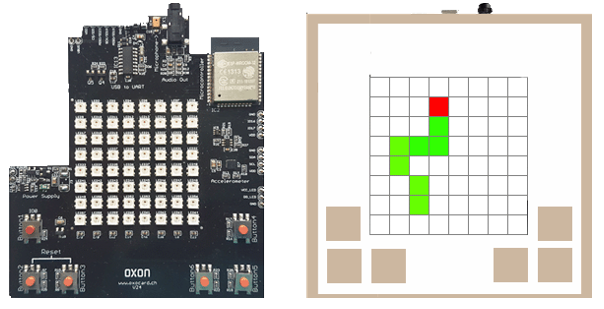

Bref aperçu
###########

L'Oxocard est une carte de développement similaire à l'Arduino ou au
micro:bit développée en Suisse et emballée dans une boîte en carton
(source d'approvisionnement :
`www.oxocard.ch <http://www.oxocard.ch/>`__). Il se compose d'une carte
10 x 10 cm basée sur le microcontrôleur ESP32, dotée de mémoire flash,
d'une matrice 8x8 de LEDs couleurs ColorLEDs (Neopixels), avec lesquels
on peut afficher des images et messages simples, de 6 boutons poussoir
et d'une interface USB. Elle dispose en outre d'un accéléromètre 3 axes
et d'un thermomètre intégré. On peut également y connecter des capteurs
et actionneurs I2C grâce au concentrateur I2C vendu sur le site du
fabricant.

   Carte de développement Oxocard et son emballage en carton écologique.

L'Oxocard est également capable de mesurer son inclinaison et ses
mouvements (par ex. tremblements) grâce à l'accéléromètre intégré et
peut communiquer avec d'autres appareils par une interface WLAN. On peut
connecter des écouteurs ou des haut-parleurs au port audio intégré pour
jouer des sons, des séquences de sons et des mélodies courtes. D'autres
actionneurs et capteurs peuvent être raccordés via les broches mais cela
nécessite quelques travaux de soudure.

.. admonition:: Informations techniques (Composants matériels de l'Oxocard)
   :class: note

   .. reveal:: reveal-oxocard-technical-specs
      :showtitle: Afficher les informations techniques
      :hidetitle: Cacher les informations techniques
      
      Voici quelques information techniques importantes concernant l'Oxocard
      
      .. figure:: Untitled-8bdbb946-e900-4970-afaf-9111e9dd74e8.png
         :alt: 

         Composants matériels de l'Oxocard