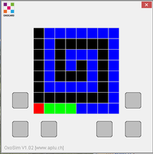

Mode simulation
===============

Si vous n'avez pas d'Oxocard, ou si vous voulez d'abord tester votre
programme sur votre PC, vous pouvez utiliser le mode simulation qui
n'offre cependant qu'une partie seulement des options matérielles
disponibles sur la carte.

