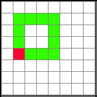

Don't Repeat Yourself
=====================

Description du problème
~~~~~~~~~~~~~~~~~~~~~~~

Le titre de cette section est volontairement en anglais car il fait référence à
un principe presque sacro-saint de l'informatique : le principe DRY (Don't
Repeat Yourself). 

En informatique, la paresse est en effet *souvent* une vertu. On veut à tout
prix éviter de faire du travail inutile et la recherche de l'efficacité maximale
y est élevée au rang de vertu cardinale. Or, dans
l':ref:`first-programs-exercice-1` du chapitre précédent, vous êtes probablement
arrivé à la solution suivante ou quelque chose de tout-à-fait similaire :

::

    from oxosnake import *

    makeSnake(dim=20)

    forward(3)
    right(90)

    forward(3)
    right(90)

    forward(3)
    right(90)

    forward(3)
    right(90)

Le problème avec ce code est qu'il est très répétitif. On constate en
effet que dessiner un carré revient à répéter 4 fois de suite la
séquence d'instructions

::

    forward(3)
    right(90)

Un autre problème est que plus on écrit de code, plus on a de chances de faire
des erreurs de programmation. Si l'erreur est recopiée en de multiples endroits,
il est fastidieux de corriger le programme. 

Le dernier problème majeur avec cette façon de faire est que, si l'on décide
tout-à-coup de modifier le nombre de fois que les instructions doivent être
répétées, il faut soit supprimer des lignes ou en rajouter, ce qui est à nouveau
une source d'erreur que l'on préférerait éviter.

..  admonition:: Information
    :class: info

    Pour résoudre ce problème, les langages de programmation fournissent des boucles
    qui sont des **structures de contrôle** permettant de répéter plusieurs fois une
    portion de code sans avoir à faire du copier/coller ou récrire le code en
    question.

Question 1
~~~~~~~~~~

..  tabbed:: dont-repeat-yourself-question-1

    ..  tab:: Donnée
            
        Indiquer au moins deux problèmes qui se posent lorsque l'on fait du
        copier/coller de code pour faire plusieurs fois une opération

        ..  shortanswer:: dont-repeat-yourself-question-1-shortanswer

            Répondez en mettant un problème par ligne

    ..  tab:: Réponse

        Si vous n'arrivez pas à répondre à ces questions, il vaut mieux relire
        cette courte section car cette notion est très importante.

Question 2
~~~~~~~~~~

..  tabbed:: dont-repeat-yourself-question-2

    ..  tab:: Donnée

        ..  mchoice:: dont-repeat-yourself-question-2-shortanswer
            :multiple_answers:
            :random:

            Quel outil presque tous les langages de programmation mettent-ils à
            disposition pour répéter des portions de code facilement ?

            -   Les boucles

                +   Oui, les langages de programmation utilisent les **boucles**
                    pour répéter des blocs de code plusieurs fois sans qu'il
                    n'y ait besoin de copier plusieurs fois des instructions.

            -   Les lacets

                -   Non, rien à voir avec les lacets de chaussure.

            -   Les structures conditionnelles

                -   Les structures conditionnelles sont une autre forme de
                    structure de contrôle permettant de prendre des décisions
                    qui seront abordées plus tard dans le cours. Ce sont les
                    **boucles** qui permettent de répéter plusieurs fois un bloc
                    d'instructions.

            -   une bagette magique

                -   Non, non, non et non! Un des buts du cours d'informatique
                    est que vous compreniez qu'il n'y a rien de magique en
                    informatique, même si cette science permet parfois des
                    exploits qui tiennent du prodige.

    ..  tab:: Réponse

        La section suivante présente ce puissant outil de base de la
        programmation : les **boucles**.

        -   Les boucles

            -   Oui, les langages de programmation utilisent les **boucles**
                pour répéter des blocs de code plusieurs fois sans qu'il
                n'y ait besoin de copier plusieurs fois des instructions.

        -   Les lacets

            -   Non, rien à voir avec les lacets de chaussure.

        -   Les structures conditionnelles

            -   Les structures conditionnelles sont une autre forme de
                structure de contrôle permettant de prendre des décisions
                qui seront abordées plus tard dans le cours. Ce sont les
                **boucles** qui permettent de répéter plusieurs fois un bloc
                d'instructions.

        -   Une bagette magique

            -   Non, non, non et non! Un des buts du cours d'informatique
                est que vous compreniez qu'il n'y a rien de magique en
                informatique, même si cette science permet parfois des
                exploits qui tiennent du prodige.

