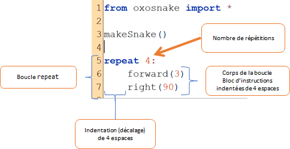

Le remède : la boucle
=====================

..  admonition:: Exemple

    On souhaite résoudre le même exercice en évitant de répéter 4 fois
    exactement le même code. Pour cela, on demande à Python de faire ce
    travail pénible avec la boucle ``repeat`` :

    ::

        from oxosnake import * 

        makeSnake()
        repeat 4:
            forward(3) 
            right(90)

On voit que le programme est bien plus court mais il y a également un
autre grand avantage. 

..  tabbed:: repetitions-example-1-question

    ..  tab:: Question

        Quels sont les avantages selon vous si l'on décide de modifier la taille du
        carré (mesure des côtés) ?

        ..  shortanswer:: repetitions-example-1-shortanswer

            Indiquer un avantage par ligne avant de consulter la réponse!

    ..  tab:: Réponse

        -   Il suffit à ce moment de changer une seule ligne ``right(90)`` au
            lieu d'avoir à en changer quatre.

        -   Un autre avantage réside dans le fait que s'il y a une erreur dans
            une partie du code, il n'est pas nécessaire de la corriger quatre
            fois.

Remarques concernant le code
----------------------------

La structure de contrôle ``repeat`` permet de répéter un bloc de code
(lignes décalées) un certain nombre de fois.

Fonctionnement de la boucle ``repeat``
++++++++++++++++++++++++++++++++++++++

La boucle ``repeat n:`` permet de répéter ``n`` fois le **bloc
d'instructions** (on parle du **corps de la boucle**). Les instructions
du bloc d'instructions à répéter doivent être décalées (on dit indentées
dans le langage technique) de manière cohérente. La convention est
d'utiliser **4 espaces** pour marquer les indentations.

..  admonition:: Information technique (indentation en Python)
    :class: info

    Dans la plupart des langages de programmation, on indente le code
    uniquement pour des raisons esthétiques. Python fait un peu figure
    d'exception dans ce domaine. L'indentation est **obligatoire** et
    fait partie de la syntaxe du langage. Le code ci-dessous va par
    exemple produire une erreur car la commande ``right(90)`` n'est pas
    indentée de la même manière que ``forward(3)``. Dans ce cours, nous
    allons donc suivre la convention qu'un niveau d'indentation
    correspond à 4 espaces.

    ::

        from oxosnake import * 

        makeSnake()
        repeat 4:
            forward(3) 
            right(90)

..  admonition:: Information technique (boucle ``repeat``)

    Le mot-clé ``repeat`` ne fait pas partie du langage Python standard
    mais a été ajouté spécialement par TigerJython pour des raisons
    didactiques. Cela permet d'aborder les boucles sans utiliser de
    variable de contrôle, ce qui rend les boucles bien plus accessibles
    pour les débutants.

    En Python standard, on va plutôt utiliser une boucle ``for`` pour
    obtenir le même effet et répéter un bloc d'instructions ``n`` fois :

    ::

        for i in range(n):
            do_something()

    Dans ce tutoriel, la boucle de répétition ``for i in range(n)`` sera
    également abordée plus tard.
